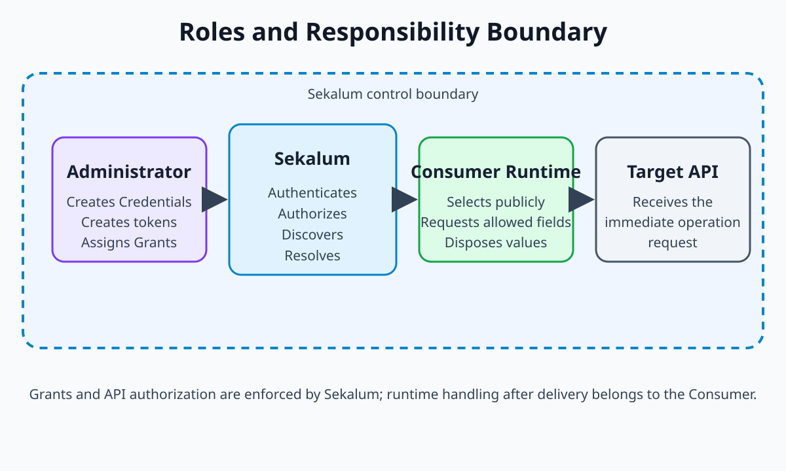
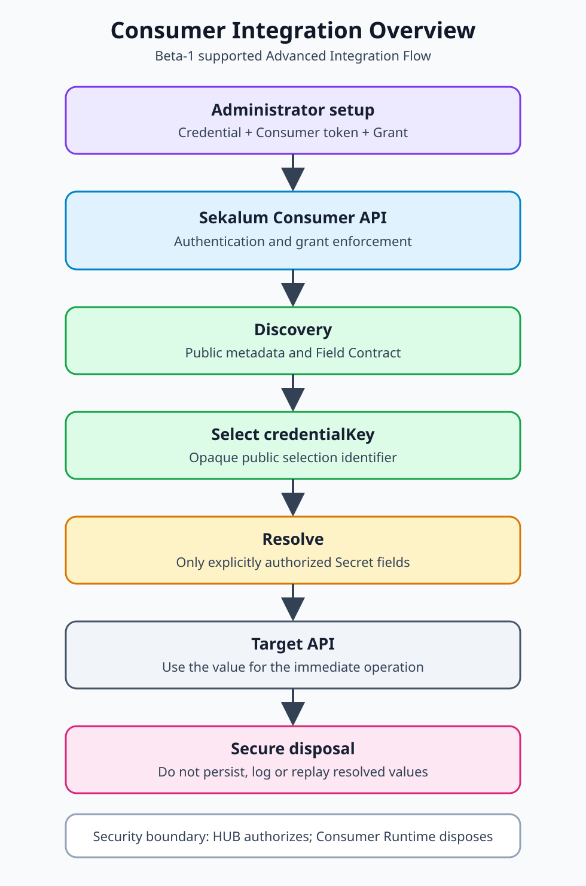
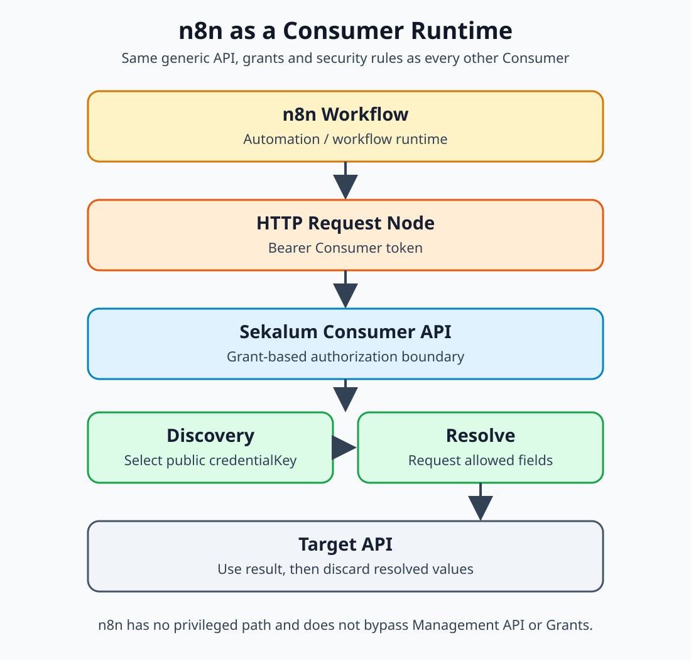

# Developer Guide

## Purpose

This guide is the active entry point for development work. It organizes the existing technical references without duplicating their domain or technical contracts.

## Technical orientation

| Topic | Leading source |
|---|---|
| Overall architecture and component roles | Overall Architecture |
| Domain objects, lifecycle and legacy boundary | [Data Model Reference](../data-model-reference/index.md) |
| HTTP routes, authentication and permissions | [API Reference](../api-reference/index.md) |
| Persistence, encryption and storage boundaries | Storage Developer Guide |
| Runtime and provider configuration | [Configuration Reference](../configuration-reference/index.md) |
| Provider capabilities and provider-specific sources | [Provider Overview](../providers/README.md) |
| Metadata-driven provider and custom-provider contract | Provider Metadata Guideline |
| Generic Credential Method architecture | ADR-021 |
| Architecture decisions | Published architecture references |
| Testing approach | Testing Strategy |

## Development rules and follow-up work

Project-wide development rules are reflected in the published contributor and developer guidance. Historical architecture reviews and milestone records are evidence and do not replace the current public sources listed above.

## Consumer Integration Foundation

This section is the first orientation for developers integrating an external
application, service, automation or workflow runtime with Sekalum. The
Beta-1 Consumer Flow is a supported Advanced Integration Flow: it is complete
and usable, but it assumes that an administrator has already configured the
Credential, Consumer token and grant. It is not a Consumer-first onboarding
flow.

### Overview and roles

The roles are deliberately separate:

- **Administrator:** creates and manages Credentials, creates or selects the
  dedicated Consumer API token, and grants access to specific Credentials and
  Secret field names.
- **Consumer Runtime:** an application, service, automation or workflow that
  uses the isolated Consumer API at runtime. It must select a Credential from
  public metadata and request only the authorized Secret fields it needs.
- **Sekalum:** the control and mediation boundary. It authenticates the
  Consumer, applies the Consumer Grant and Credential lifecycle checks, exposes
  public selection metadata, and resolves only explicitly authorized fields.
- **Target API:** the external service that the Consumer calls after obtaining
  the required, transient Credential values. Sekalum is not the Target
  API or the Consumer's application runtime.



*Roles and Responsibility Boundary: Sekalum authorizes the handoff; the
Consumer Runtime controls use and disposal after delivery.*

### Roles and architecture

The integration boundary can be understood as:

```text
Administrator
    |
    | Credential + Grant + permissions
    v
Sekalum
    |
    | authenticated Consumer API access
    v
Consumer Runtime
    |
    | Discovery and public Field Contract
    v
Credential selection by credentialKey
    |
    | Resolve of explicitly authorized Secret fields
    v
Target API
```



*Consumer Integration Overview: the administrator prepares access, while the
Consumer Runtime uses only the public selection and authorized Resolve path.*

The Management API is used for administration. The Consumer API is a separate
data-plane boundary and is method-agnostic; Provider and CredentialMethod
internals are not part of the Consumer contract. See ADR-020
and ADR-021 for the
normative architecture decisions.

### Consumer integration lifecycle

An integration follows this sequence:

1. An administrator creates or activates the Credential, creates or selects a
   dedicated Consumer API token, and grants the required Secret field names.
2. The Consumer Runtime authenticates with that token and calls Discovery.
3. Discovery returns only active, granted Credentials, public metadata, the
   public Field Contract and the opaque `credentialKey`.
4. The Consumer selects exactly one `credentialKey` using public business
   criteria and determines which requested Secret fields are required.
5. The Consumer calls Resolve for those explicitly authorized fields.
6. The Consumer uses the resolved values for its target operation and then
   discards them as far as the runtime permits.

The complete HTTP contract, response shapes, error handling and selection rules
are defined by the [API Reference](../api-reference/index.md#canonical-consumer-integration-algorithm).
The [Quick Start Guide](../quick-start-guide/index.md#using-the-consumer-interface-advanced-integration-flow)
shows the corresponding Beta-1 interface flow.

For runnable examples using only standard runtime APIs, see the
[Node.js Consumer Runtime example](#nodejs-consumer-runtime-example) and the
[Python Consumer Runtime example](#python-consumer-runtime-example) below.

### Quick Start: Discovery to Resolve

Use this sequence when the administrative setup is already complete:

```text
Grant Setup
    ↓
Consumer Authentication
    ↓
Discovery
    ↓
credentialKey selection
    ↓
Resolve
    ↓
Target API use
    ↓
Secure Disposal
```

#### Prerequisites

You need:

- the Sekalum base URL;
- an active Consumer API token with `credentials:consume` and the matching
  owner permission;
- an active Credential visible to that Consumer; and
- a Consumer Grant allowing the selected Credential, provider and requested
  Secret field names.

The Credential, token and grant are provisioned administratively before the
runtime flow begins. The Consumer API token is not a Management API token.

#### 1. Discover available Credentials

Call Discovery with the dedicated Consumer token:

```bash
curl --fail --silent --show-error \
  -H "Authorization: Bearer <consumer-token>" \
  "https://<credential-hub>/api/v1/consumer/credentials"
```

A successful response contains active Credentials granted to the authenticated
Consumer, public metadata, the applicable Field Contract and an opaque public
`credentialKey`. It contains no Secret values, internal identifiers,
CredentialMethod details or Provider Adapter data. A valid Consumer with no
matching grant receives an empty `credentials` array.

#### 2. Select one public `credentialKey`

Select exactly one Credential using public metadata and the Field Contract.
The `credentialKey` is the only identifier to carry into Resolve. Do not use
internal Credential IDs, Provider keys, CredentialMethod details or Secret
values as selection criteria. Request only Secret field names that are known
to be required and present in the public Field Contract with `secret == true`.

#### 3. Resolve the authorized fields

Pass the selected public key and only the required Secret field names:

```bash
curl --fail --silent --show-error \
  -X POST \
  -H "Authorization: Bearer <consumer-token>" \
  -H "Content-Type: application/json" \
  -d '{
    "secretNames": ["<required-secret-field-name>"]
  }' \
  "https://<credential-hub>/api/v1/consumer/credentials/<credentialKey>/resolve"
```

The response contains only the selected public key, lifecycle state and the
requested, authorized field values. The Consumer must validate the response
shape and must not broaden the field list or retry with a Management token
after an error. The exact response and error envelope remain defined by the
[API Reference](../api-reference/index.md#resolve-a-credential).

#### 4. Use and dispose of the result

Use the resolved values only for the immediate target operation. Treat them as
transient runtime data: do not persist them, log them, put them in URLs,
include them in retry payloads or return them in complete workflow output.
Discard them as soon as the target operation permits. Sekalum responses
use `Cache-Control: no-store`; this does not replace the Consumer Runtime's
own secure disposal responsibilities.

#### Expected failures

| Condition | Meaning and expected behavior |
|---|---|
| Invalid Consumer token | `401` / `API_TOKEN_AUTH_FAILED`; stop and correct the Consumer authentication. |
| Missing Consumer scope or denied access | `403` / `CONSUMER_SCOPE_MISSING` or `CONSUMER_ACCESS_DENIED`; do not retry with a Management token. |
| No matching grant | Discovery succeeds with an empty `credentials` array; resolve is not possible until an administrator grants access. |
| Credential not found | `404` / `CREDENTIAL_NOT_FOUND`; discard the stale `credentialKey` and run Discovery again. |
| Credential not consumable | `409` / `CREDENTIAL_NOT_CONSUMABLE`; do not attempt to bypass the lifecycle state. |
| Invalid Secret request | `400` / `INVALID_SECRET_REQUEST`; correct the field selection against the public Field Contract. |

Consumers must treat unknown response shapes and other failures as errors and
must not expose raw response data or Secret values in logs.

### Node.js Consumer Runtime example

The following example requires Node.js 18 or newer for the native `fetch` API.
It uses public Discovery metadata to select exactly one Credential, carries
only the opaque `credentialKey` into Resolve, uses the authorized result for a
target operation, and clears the in-memory reference in `finally`.

Set `CREDENTIAL_HUB_URL`, `CREDENTIAL_HUB_TOKEN` and
`CREDENTIAL_DISPLAY_NAME` in the runtime environment. Do not put the token or
resolved values in source files, URLs, logs or persistent workflow data.

```js
const hubUrl = process.env.CREDENTIAL_HUB_URL;
const consumerToken = process.env.CREDENTIAL_HUB_TOKEN;
const targetDisplayName = process.env.CREDENTIAL_DISPLAY_NAME;
const requiredSecretNames = ['apiKey'];

if (!hubUrl || !consumerToken || !targetDisplayName) {
  throw new Error('Missing Consumer runtime configuration');
}

async function requestJson(url, options) {
  const response = await fetch(url, options);
  let body;

  try {
    body = await response.json();
  } catch {
    throw new Error(`Sekalum returned a non-JSON response (${response.status})`);
  }

  if (!response.ok || body?.success === false) {
    const code = body?.error?.code ?? `HTTP_${response.status}`;
    throw new Error(`Sekalum request failed: ${code}`);
  }

  return body;
}

async function useCredential({ credentialKey, secrets }) {
  // Use the authorized value only for the immediate target operation.
  // Never log or persist `secrets`.
  return {
    target: 'example-target-operation',
    credentialKey,
    accepted: typeof secrets.apiKey === 'string' && secrets.apiKey.length > 0,
  };
}

async function runConsumer() {
  let resolvedSecrets;

  try {
    const discovery = await requestJson(
      `${hubUrl}/api/v1/consumer/credentials`,
      { headers: { Authorization: `Bearer ${consumerToken}` } },
    );

    const credentials = discovery?.data?.credentials;
    if (!Array.isArray(credentials)) {
      throw new Error('Discovery response did not contain credentials');
    }

    const matches = credentials.filter((credential) => {
      const displayName = credential?.metadata?.displayName;
      const fields = Array.isArray(credential?.fields) ? credential.fields : [];
      return displayName === targetDisplayName && requiredSecretNames.every((name) =>
        fields.some((field) => field?.name === name && field?.secret === true),
      );
    });

    if (matches.length !== 1) {
      throw new Error(`Expected exactly one public Credential match, found ${matches.length}`);
    }

    const credentialKey = matches[0]?.credentialKey;
    if (typeof credentialKey !== 'string' || credentialKey.length === 0) {
      throw new Error('Selected Credential has no public credentialKey');
    }

    const resolved = await requestJson(
      `${hubUrl}/api/v1/consumer/credentials/${encodeURIComponent(credentialKey)}/resolve`,
      {
        method: 'POST',
        headers: {
          Authorization: `Bearer ${consumerToken}`,
          'Content-Type': 'application/json',
        },
        body: JSON.stringify({ secretNames: requiredSecretNames }),
      },
    );

    resolvedSecrets = resolved?.data?.secrets;
    if (!resolvedSecrets || typeof resolvedSecrets !== 'object') {
      throw new Error('Resolve response did not contain authorized Secret fields');
    }

    const result = await useCredential({ credentialKey, secrets: resolvedSecrets });
    console.log(`Target operation completed: ${result.accepted}`);
  } catch (error) {
    // Keep error output structural and secret-free. Do not print response bodies.
    console.error(error instanceof Error ? error.message : 'Consumer request failed');
    process.exitCode = 1;
  } finally {
    // Drop the resolved Secret reference after the target operation.
    if (resolvedSecrets && typeof resolvedSecrets === 'object') {
      for (const key of Object.keys(resolvedSecrets)) resolvedSecrets[key] = undefined;
    }
    resolvedSecrets = undefined;
  }
}

runConsumer().catch(() => {
  console.error('Consumer runtime stopped unexpectedly');
  process.exitCode = 1;
});
```

The example intentionally does not log `resolvedSecrets`, write them to a
file, place them in a URL, or persist them in application state. The
`finally` block releases the runtime reference after use; the surrounding
application remains responsible for applying its own secure disposal controls.

### Python Consumer Runtime example

The following example requires Python 3.10 or newer and uses only the Python
standard library. It performs the same language-independent Consumer flow as
the Node.js example: public Discovery, deterministic public selection,
explicit Resolve, immediate target use and best-effort release of the in-memory
Secret mapping.

Set `CREDENTIAL_HUB_URL`, `CREDENTIAL_HUB_TOKEN` and
`CREDENTIAL_DISPLAY_NAME` in the runtime environment. Do not put the token or
resolved values in source files, URLs, logs or persistent workflow data.

```python
import json
import os
import sys
from urllib.error import HTTPError, URLError
from urllib.parse import quote
from urllib.request import Request, urlopen


class ConsumerApiError(RuntimeError):
    """A safe, secret-free Consumer API failure."""


def request_json(base_url, token, path, *, method="GET", payload=None):
    body = None
    headers = {"Authorization": f"Bearer {token}"}
    if payload is not None:
        body = json.dumps(payload).encode("utf-8")
        headers["Content-Type"] = "application/json"

    request = Request(
        f"{base_url.rstrip('/')}{path}",
        data=body,
        headers=headers,
        method=method,
    )

    try:
        with urlopen(request, timeout=20) as response:
            response_body = json.load(response)
    except HTTPError as error:
        try:
            error_body = json.load(error)
        except (ValueError, TypeError):
            error_body = {}
        code = error_body.get("error", {}).get("code", f"HTTP_{error.code}")
        raise ConsumerApiError(f"Sekalum request failed: {code}") from None
    except (URLError, TimeoutError, ValueError) as error:
        raise ConsumerApiError("Sekalum request could not be completed") from error

    if not isinstance(response_body, dict) or response_body.get("success") is False:
        code = response_body.get("error", {}).get("code", "INVALID_RESPONSE")
        raise ConsumerApiError(f"Sekalum request failed: {code}")

    return response_body


def discover_credentials(base_url, token):
    response = request_json(base_url, token, "/api/v1/consumer/credentials")
    credentials = response.get("data", {}).get("credentials")
    if not isinstance(credentials, list):
        raise ConsumerApiError("Discovery response did not contain credentials")
    return credentials


def select_credential(credentials, display_name, required_secret_names):
    matches = []
    for credential in credentials:
        metadata = credential.get("metadata", {})
        fields = credential.get("fields", [])
        allowed_secret_names = {
            field.get("name")
            for field in fields
            if field.get("secret") is True
        }
        if (
            metadata.get("displayName") == display_name
            and set(required_secret_names).issubset(allowed_secret_names)
        ):
            matches.append(credential)

    if len(matches) != 1:
        raise ConsumerApiError(
            f"Expected exactly one public Credential match, found {len(matches)}"
        )

    credential_key = matches[0].get("credentialKey")
    if not isinstance(credential_key, str) or not credential_key:
        raise ConsumerApiError("Selected Credential has no public credentialKey")
    return credential_key


def resolve_secrets(base_url, token, credential_key, secret_names):
    path_key = quote(credential_key, safe="")
    response = request_json(
        base_url,
        token,
        f"/api/v1/consumer/credentials/{path_key}/resolve",
        method="POST",
        payload={"secretNames": list(secret_names)},
    )
    secrets = response.get("data", {}).get("secrets")
    if not isinstance(secrets, dict):
        raise ConsumerApiError("Resolve response did not contain authorized Secret fields")
    return secrets


def use_credential(credential_key, secrets):
    # Use the authorized value only for the immediate target operation.
    # Never print, persist or return the Secret itself.
    accepted = isinstance(secrets.get("apiKey"), str) and bool(secrets["apiKey"])
    return {"target": "example-target-operation", "credentialKey": credential_key, "accepted": accepted}


def run_consumer():
    base_url = os.environ.get("CREDENTIAL_HUB_URL")
    token = os.environ.get("CREDENTIAL_HUB_TOKEN")
    display_name = os.environ.get("CREDENTIAL_DISPLAY_NAME")
    required_secret_names = ("apiKey",)
    resolved_secrets = None

    if not base_url or not token or not display_name:
        raise ConsumerApiError("Missing Consumer runtime configuration")

    try:
        credentials = discover_credentials(base_url, token)
        if not credentials:
            raise ConsumerApiError("Discovery returned no granted Credentials")

        credential_key = select_credential(
            credentials, display_name, required_secret_names
        )
        resolved_secrets = resolve_secrets(
            base_url, token, credential_key, required_secret_names
        )
        result = use_credential(credential_key, resolved_secrets)
        print(f"Target operation completed: {result['accepted']}")
    finally:
        # Drop the Secret mapping after the target operation.
        if resolved_secrets is not None:
            resolved_secrets.clear()


if __name__ == "__main__":
    try:
        run_consumer()
    except ConsumerApiError as error:
        # Keep error output structural and secret-free; never print response bodies.
        print(str(error), file=sys.stderr)
        raise SystemExit(1) from None
```

The example uses `credentialKey` only as the public selection path segment; it
does not treat it as a Secret. Discovery metadata is used for selection and
contains no Secret values. The resolved mapping is used only for the target
operation and cleared in `finally`; the runtime must still apply its own secure
disposal controls because clearing a Python mapping is not a guaranteed memory
wipe.

### Terms at a glance

| Term | Meaning |
|---|---|
| Consumer Runtime | The external application, service, automation or workflow that calls the Consumer API. |
| Discovery | The `GET /api/v1/consumer/credentials` operation that returns public metadata and the applicable Field Contract for granted active Credentials. |
| `credentialKey` | The opaque public identifier used by the Consumer to select a Credential for Resolve. |
| Field Contract | The public description of selectable fields and their classifications; it contains no Secret values. |
| Grant | The administrator-controlled authorization binding a Consumer token identity to one Credential, provider and permitted Secret field names. |
| Resolve | The `POST /api/v1/consumer/credentials/{credentialKey}/resolve` operation for explicitly authorized Secret fields. |
| Secret Handling | The transient-use rule: do not persist, log, place in URLs or return resolved values in complete workflow output. |

### n8n and other runtimes

n8n is not a special Sekalum integration. It is a workflow runtime and
one possible HTTP Consumer Runtime, alongside a custom application, service or
automation. It is not a Sekalum plugin, a Credential Provider, or a
privileged access path.



*n8n Consumer Runtime: the HTTP Request node follows the same Discovery and
Resolve path as every other Consumer.*

An n8n workflow uses the same generic Consumer API path, permissions, grants
and security rules as every other Consumer:

```text
n8n Workflow
    |
    | HTTP Request Node
    v
Sekalum Consumer API
    |
    v
Discovery
    |
    v
credentialKey selection
    |
    v
Resolve
    |
    v
Target API
```

The workflow supplies a dedicated Consumer token to the HTTP Request node,
calls `GET /api/v1/consumer/credentials`, selects one public `credentialKey`,
and calls `POST /api/v1/consumer/credentials/{credentialKey}/resolve` with
only the permitted `secretNames`. The grant remains authoritative; n8n cannot
select Credentials or fields outside that grant.

n8n must not call the Management API, bypass grants, request wildcard fields,
or publish resolved values through workflow logs, execution data, persistent
node data or other uncontrolled storage. Resolved values are transient runtime
data and must be discarded after the target operation. The [Security
Guide](../security-guide/index.md#consumer-trust-boundary) defines the
responsibility boundary after delivery.

The repository contains an internal OpenAI-specific n8n governance test
artifact, but it is not a public product integration or a general-purpose
quick-start workflow. The generic Consumer API procedure above is the
supported integration guidance for n8n and all other runtimes.

For security responsibilities after delivery, see the [Security Guide](../security-guide/index.md#consumer-trust-boundary).

### Real Beta-1 product journey

The architecture diagrams in this guide are complemented by redacted captures
from the running Beta-1 UI. The [Consumer Integration Quick Start visual
journey](../quick-start-guide/index.md#beta-1-product-journey-real-ui) shows
the administrator entry, Credential and Grant setup, Consumer token form and
the separate Consumer entry surface before continuing with the existing
Discovery → Resolve screenshots.

## Generic Credential Method architecture

The active model separates an external Provider from its Credential Methods. A Provider may expose multiple declarative CredentialMethods and ProviderMethodBindings, while a Credential created for such a Provider records one explicit `credentialMethodKey`. The selected CredentialMethod defines the field schema, secret fields, and operation capabilities; its Provider binding can supply an adapter only for an operation declared by the method. Application code must not infer a method from a Provider key, an `authType`, or secret names.

R5 implements the Provider Registry, Wizard, Dashboard, REST, CSV, import/export, lifecycle dispatch, and Credential model around this contract. Method-aware creation rejects a missing or unbound method; startup persists an explicit compatible method key for deterministically migratable legacy records and rejects ambiguous records with `CREDENTIAL_METHOD_MIGRATION_AMBIGUOUS`. No legacy Provider-level runtime selection remains. The Discord webhook binding is the reference implementation only: it has declarative metadata and no declared operations. Do not add webhook or other method-specific special cases to the Core or Consumer API. See ADR-021 for the binding contract and migration boundary.

## Admin internationalization baseline

The Admin UI uses shared language resolution and translation catalogs under `public/admin/`. English is the complete fallback catalog. A stored `credentialHub.language` preference overrides browser detection; only browser languages beginning with `de` select German when no valid preference exists. User-controlled provider names, credential names, IDs, URLs, scopes, and technical identifiers are rendered as data and are not translated.

The UI displays localized known error codes or a generic localized fallback. It must not expose raw backend messages, stack traces, or internal details to users. Server logs remain English and API response contracts are not rewritten by this baseline.

## OAuth provider configuration and Admin shell

Built-in OAuth providers declare their application fields through the shared metadata model. `ProviderConfigurationService` validates and persists complete application configuration through `ProviderConfigurationStore`, which uses the existing encrypted JSON storage boundary. `ProviderManager` carries the configuration through the one-time OAuth state context and records only an internal configuration ID with the resulting credential so refresh can resolve the same encrypted configuration.

The Admin pages share `public/admin/admin-shell.js` for BASE_PATH-aware navigation and public support/legal links. The Wizard consumes provider metadata and starts OAuth through the authorized API route. The callback page communicates with its opener through the versioned `credential-hub:oauth-result` message contract; the receiver must verify origin, source window, message type, version, and provider before acting.

## Declarative custom-provider onboarding

The Admin **Custom providers** flow posts only declarative identity, presentation, methods, method bindings, and credential-field schemas to `POST /api/v1/providers`. `CustomProviderService` validates this closed request shape, persists it through `CustomProviderDefinitionStore`, registers it in the existing Provider Registry, and startup hydration restores the same definitions before the application is served. This is intentionally not a second Provider execution path: custom definitions use the existing Provider summary and Credential Wizard contract but declare no runtime operations or OAuth behavior.

Do not extend this path with provider-configuration fields, OAuth settings, adapters, executable code, hooks, scripts, API clients, or secret values. Such properties are rejected at the REST boundary. A field-level `secret` flag remains schema metadata; it authorizes secure handling only when a Credential is later created.

## Consumer API integration

Runtime consumers use the isolated Consumer API rather than the Management API. They authenticate with an active Bearer API token that has the `credentials:consume` scope and whose owner has the same permission. The consumer identity is the API-token ID; before runtime use, an administrator provisions an explicit grant through `POST /api/v1/management/consumer-grants` with `consumerId`, `credentialId`, `providerKey`, and the permitted `secretNames`. The grant must allow the target Credential, provider, and each requested secret field. Only active Credentials and fields marked secret by the selected CredentialMethod can be resolved. The Consumer route remains method-agnostic and returns no CredentialMethod identifier or other internal method metadata. See the [API Reference](../api-reference/index.md) for the response and error contract and ADR-020 for the architecture decision.

When Discovery provides an optional Runtime-Public projection, use only the
values explicitly classified for the selected Credential and authenticated
Consumer. Runtime-Public values originate from the Provider Configuration
associated with that Credential; they are not taken from global Provider
metadata, Consumer configuration or environment variables. A missing
projection is valid and must not trigger a fallback. Consumers must not choose
arbitrary fields or access another Credential's Provider Configuration.

Any generic HTTP client, including an n8n HTTP Request node, can call the endpoint without a product-specific integration:

```http
POST /api/v1/consumer/credentials/credential-123/resolve HTTP/1.1
Host: sekalum.example
Authorization: Bearer <consumer-api-token>
Content-Type: application/json

{"secretNames":["apiKey"]}
```

Read the returned value only in the executing workflow step. Do not place the token or resolved value in source control, workflow notes, logs, retry payloads, or persistent node data; honor the response `Cache-Control: no-store`. A failed request must be handled as an error rather than retried with a broader field list or a management credential.

### Canonical Consumer Integration Algorithm

The [API Reference](../api-reference/index.md#canonical-consumer-integration-algorithm)
is the normative source for the platform-independent Beta-1 Consumer
integration sequence and its selection, transient-use and disposal rules. The
Developer Guide provides implementation orientation only; it does not define
an alternative algorithm, platform-specific behavior or provider exception.

The canonical sequence is Discovery, optional Runtime-Public projection,
Credential Selection, Resolve, Target API use and Secure Disposal. Selection
configuration distinguishes Required Public Fields, which only need to exist
in the public Field Contract, from Required Secret Fields, which must also be
classified with `secret == true` before they may be requested through Resolve.
The API Reference defines the complete rule and remains normative.

Resolved Secrets remain transient Consumer runtime values. They must not be
persisted, logged, placed in URLs, included in retries or returned in complete
workflow/execution output. Runtime-Public values do not become a second Secret
channel; they remain limited to the explicitly classified projection.

Until future convenience features such as server-side Discovery filters or
native integrations are introduced through a separate decision, consumers use
the existing public Consumer API through a generic HTTP-client flow.

## AI-assisted workflow and quality gates

AI may assist implementation, documentation, tests, review preparation, refactoring suggestions, and architecture discussion. It does not replace architectural decisions, code review, security review, release approval, or project ownership. Every change is subject to the same capability audit, architecture boundary review, automated tests, documentation review, and maintainer approval. The complete policy is in AI-Assisted Development.

## Community channels

The official [Sekalum Discord community](https://discord.gg/exTu3Dy2UW) supports technical questions, development discussion, community questions, and feature ideas. GitHub remains authoritative for Issues, Pull Requests, release tracking, and project planning. Security vulnerabilities must follow the [Security Guide](../security-guide/index.md) and must not be posted to Discord.

## Abgrenzung

This guide defines neither API payloads nor data-model or storage contracts.
Changes to those boundaries are documented in the relevant canonical
references, associated tests and, where applicable, ADRs.
